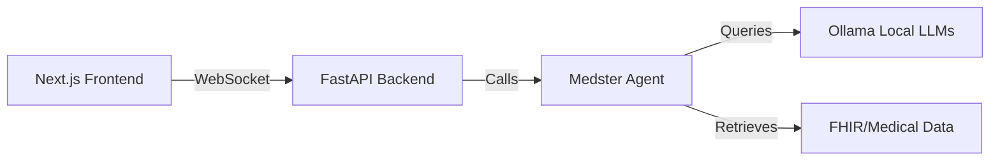

# Add Next.js + Tailwind CSS Frontend to Medster-local-LLM

## Goal

Add a modern, beautiful web interface to Medster-local-LLM, which currently only has a CLI. The frontend will provide a chat-based interface for interacting with the local LLM-powered medical analysis agent, while preserving the existing backend architecture that uses Ollama models.

## Architecture Overview



The solution will:
1. **Create a FastAPI backend** that wraps the existing Medster Agent class
2. **Build a Next.js frontend** with a premium, modern UI using Tailwind CSS
3. **Use WebSockets** for real-time streaming of agent responses
4. **Preserve the local LLM architecture** - no API keys, everything runs locally

## Proposed Changes

### Backend API Layer

#### [NEW] [api.py](file:///Users/sbm4_mac/Desktop/Medster-local-LLM/src/medster/api.py)

Create a FastAPI application that:
- Exposes WebSocket endpoint `/ws/chat` for streaming agent responses
- Provides REST endpoint `/api/models` to get available Ollama models
- Provides REST endpoint `/api/select-model` to set the active model
- Integrates with existing `Agent` class from `medster.agent`
- Implements CORS middleware for local development
- Streams agent logs and responses in real-time to the frontend

#### [MODIFY] [agent.py](file:///Users/sbm4_mac/Desktop/Medster-local-LLM/src/medster/agent.py)

Modify the Agent class to support streaming callbacks:
- Add optional `callback` parameter to `run()` method
- Emit events for: task start, tool execution, task completion, final answer
- Allow the API to intercept and stream these events to the frontend

---

### Frontend Application

#### [NEW] Frontend Directory Structure

Create a new `frontend/` directory in Medster-local-LLM with:
```
frontend/
├── app/
│   ├── layout.tsx          # Root layout with Tailwind
│   ├── page.tsx            # Main chat interface
│   └── globals.css         # Tailwind + custom styles
├── components/
│   ├── ChatInterface.tsx   # Main chat component
│   ├── MessageList.tsx     # Display messages
│   ├── MessageInput.tsx    # User input
│   ├── ModelSelector.tsx   # Choose Ollama model
│   └── StatusIndicator.tsx # Connection/processing status
├── lib/
│   ├── websocket.ts        # WebSocket client
│   └── types.ts            # TypeScript types
├── package.json
├── tsconfig.json
└── tailwind.config.js
```

#### Design Aesthetic

The UI will feature:
- **Dark mode medical theme** with deep blues and teals
- **Glassmorphism effects** for cards and panels
- **Smooth animations** for message appearance and status changes
- **Medical-inspired color palette** (professional but modern)
- **Responsive layout** that works on desktop and tablet
- **Real-time status indicators** showing agent thinking/processing
- **Syntax highlighting** for medical data (labs, vitals, etc.)

---

### Configuration Files

#### [NEW] [run_dev.sh](file:///Users/sbm4_mac/Desktop/Medster-local-LLM/run_dev.sh)

Bash script to start both backend and frontend:
```bash
#!/bin/bash
# Start FastAPI backend
uvicorn medster.api:app --reload --port 8000 &
# Start Next.js frontend
cd frontend && npm run dev &
```

#### [MODIFY] [README.md](file:///Users/sbm4_mac/Desktop/Medster-local-LLM/README.md)

Add documentation for:
- Running the web interface
- API endpoints
- Frontend development setup

#### [MODIFY] [pyproject.toml](file:///Users/sbm4_mac/Desktop/Medster-local-LLM/pyproject.toml)

Add FastAPI dependencies:
- `fastapi`
- `uvicorn[standard]`
- `websockets`
- `python-multipart`

## Verification Plan

### Automated Tests

1. **Backend API Tests**
   ```bash
   # From Medster-local-LLM root
   pytest tests/test_api.py -v
   ```
   - Test WebSocket connection
   - Test model selection endpoint
   - Test streaming responses

2. **Frontend Build Test**
   ```bash
   # From frontend directory
   npm run build
   ```
   - Verify Next.js builds without errors
   - Check for TypeScript errors

### Manual Verification

1. **Start the full stack**
   ```bash
   cd /Users/sbm4_mac/Desktop/Medster-local-LLM
   ./run_dev.sh
   ```

2. **Test in browser**
   - Navigate to `http://localhost:3000`
   - Verify the UI loads and looks premium/modern
   - Select a model (gpt-oss:20b or qwen3-vl:8b)
   - Send a test query: "Analyze patient 12345's latest lab results"
   - Verify real-time streaming of agent responses
   - Check that medical data displays correctly
   - Test multiple queries in succession

3. **Verify local-only operation**
   - Disconnect from internet
   - Verify the app still works (proving it's 100% local)
   - Check that no API keys are required

### Browser Testing

I will use the browser subagent to:
- Verify the UI renders correctly
- Test the chat interface interaction
- Capture screenshots of the final design
- Validate responsive behavior
